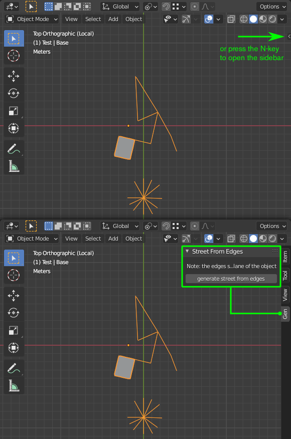
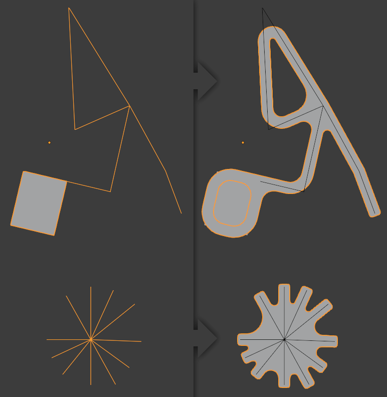
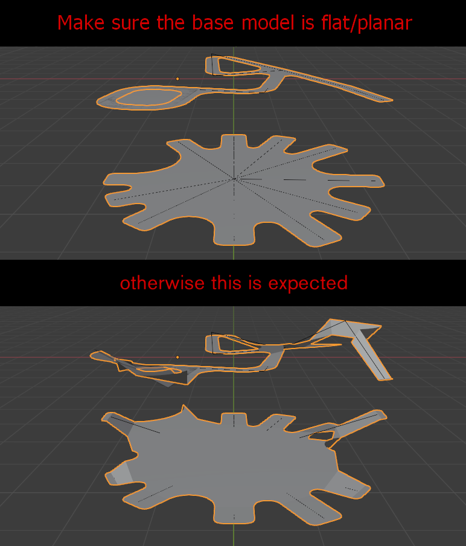
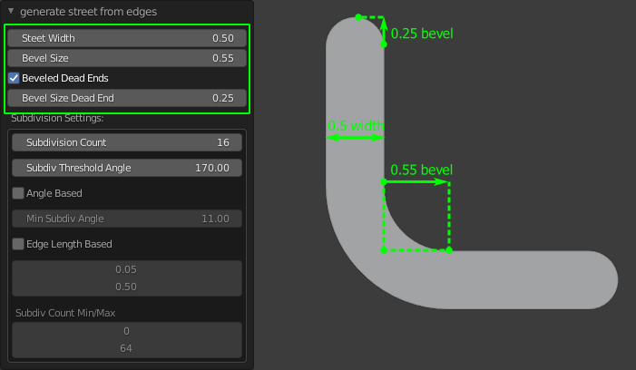
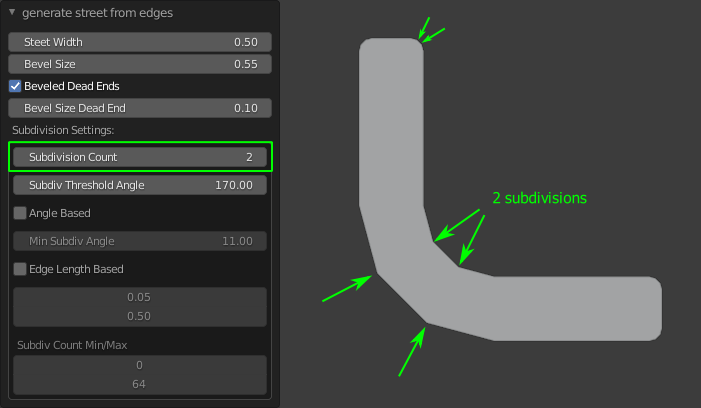
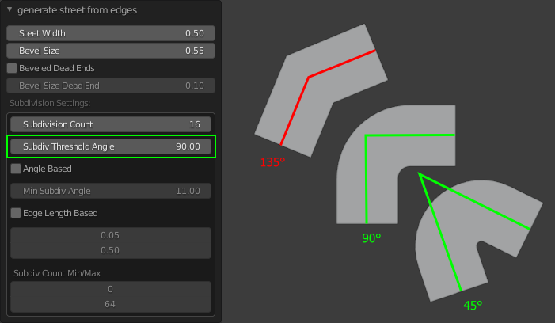
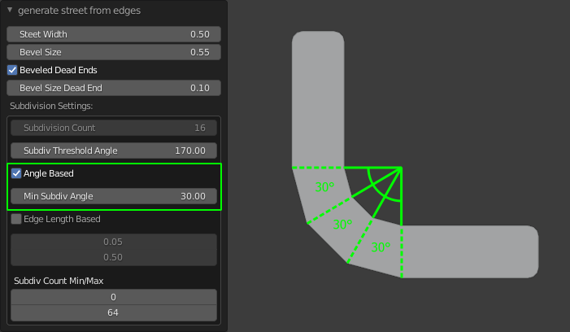
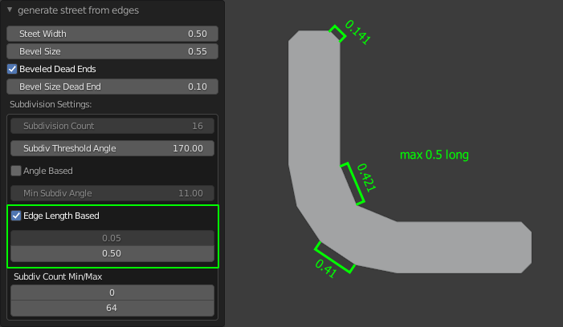
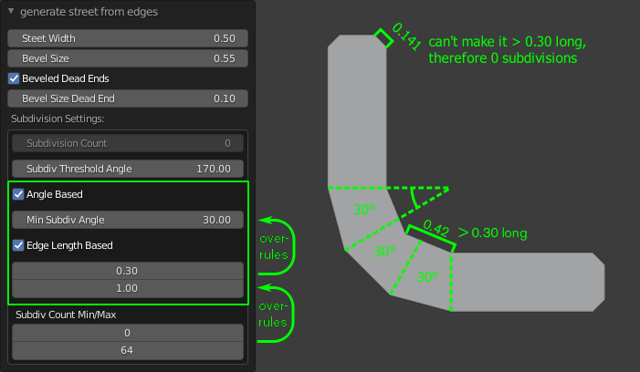
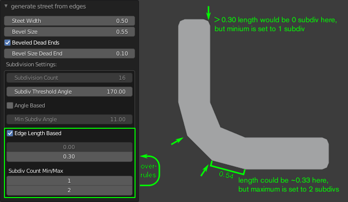

# Street Generation From Edges
created for Blender 2.90 but might work for alder versions  

# Description
You can find the generate button in the Sidebar of the 3D View (to the right or press N to toggle it). In the Sidebar is a tab called Gen.  
  
This Blender script generates street like geometry from the edges of a user created base mesh object.  
  

# Setup
In Blender navigate to:  
"Edit >> Preferences... >> Add-Ons (Category) > Install..."  
and select the "StreetGenFromEdges.py" file  

Alternatively copy the text inside the script "StreetGenFromEdges.py" file into the text editor and press the "Run Script" button (might be just a triangle/play symbol).  
You can find it in the sidebar in the "Gen" Tab.  

# Important Note
This script is intended to work with 2D like mesh objects.  
You can scale your base mesh vertices (in edit mode) on the local z-axis to zero to make sure it is planar.

# Options
Set the bevel size (length) of an arc for the street corners. The bevel is always based on the inner edge of a street corner. Also, dead ends of the street network can have beveled ends attached.  
  
Set a fixed subdivision count for the beveld street corners.  
  
If a street corners angle is bigger than the threshold angle, this will be a hard corner. This is useful for a highly subdivided base mesh with smooth turns in the street.  
  
The subdivision count of an arc is calculated based on an angle. The bigger the street corners angle, the more subdivisions.  
  
The subdivision count of an arc is calculated based on the maximum length an edge is allowed to have. The longer the arc, the more subdivision.  
  
Angle and Edge Length Based can be used together. The minimal edge length might force more subdivisions and the maximum edge length might clamp the angle based subdivision. (depending on the settings)  
  
In the Bottom is a Min/Max Subdivision setting that clamps the subdivision count calculated by Angle and/or Edge Length Based method.  
The Angle Based Subdivision gets overruled by the Edge Length Subdivision and that by the Subdivision Count Min/Max.  
  
